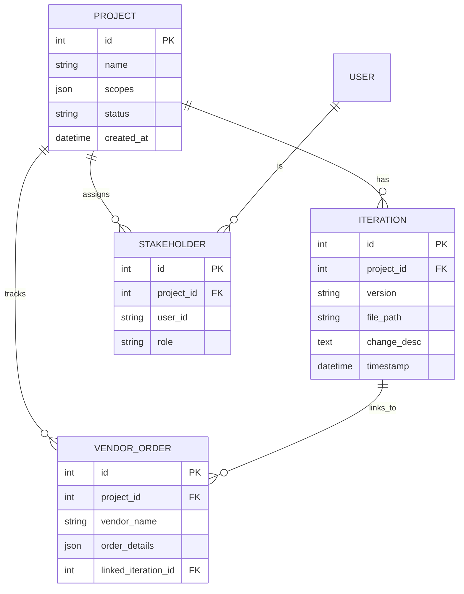

# Manufacturing Project Management Tool (ManuPM)

## 1. Project Overview
- **Name**: ManuPM (Manufacturing Project Manager)
- **Purpose**: A custom project management tool tailored for manufacturing workflows, focusing on lightweight file tracking (metadata only), visual design iteration history, multi-stakeholder collaboration, scope change logging, and vendor/order management. Includes standard PM features like tasks and reporting.
- **Target Users**: Project managers, designers, stakeholders, vendors in manufacturing firms.
- **Key Principles**:
  - **No File Storage**: Store only paths/URLs to external sources (OneDrive, local drives).
  - **Visual-First Iterations**: Timelines/Gantt charts for design changes.
  - **Scalable**: Supports multiple projects with custom scopes/apps.
  - **Secure**: Role-Based Access Control (RBAC) for stakeholders; audit logs for changes.
- **Tech Stack**:
  - **Backend**: Python 3.12 + FastAPI + SQLAlchemy (PostgreSQL).
  - **Frontend**: React (Vite) + Material-UI + Recharts/react-vis-timeline.
  - **Database**: PostgreSQL.
  - **Deployment**: Docker Compose.
  - **Tools**: VS Code, Git, Alembic (migrations), GitHub Copilot/AI for code generation.

## 2. Feature List
Prioritized features for the Minimum Viable Product (MVP), enhancements, and future roadmap. Each includes user story, acceptance criteria, estimated effort, and dependencies.

| Priority | Feature | User Story | Acceptance Criteria | Effort (Weeks) | Dependencies |
|----------|---------|------------|----------------------|----------------|--------------|
| **Core (MVP)** | 1. Project Creation & Management | As a PM, I can create/view/edit projects with custom scopes (e.g., JSON for apps like CAD/ERP). | - CRUD APIs/UI for projects. - Scopes as editable JSON fields. - List view with search/filter by status. | 1 | DB models |
| **Core** | 2. File Iteration Tracking | As a designer, I can log file changes with version, path/URL, and description; system stores metadata only. | - Upload form: Version, path (hyperlink/local), desc. - Fetch metadata (e.g., last modified via API). - No file upload—redirect to source on click. - Validation: Check if path is valid OneDrive/local. | 1.5 | File integration |
| **Core** | 3. Visual Iteration Timeline | As a stakeholder, I can see a timeline of design iterations over time. | - React component: Horizontal timeline with nodes (versions), edges (changes), tooltips (desc/file link). - Filter by phase (e.g., design/review). - Colors: Green=approved, red=scope change. | 1 | Iterations API |
| **Core** | 4. Multi-Stakeholder Management | As an admin, I can assign roles (e.g., designer, vendor) to users per project. | - RBAC: JWT auth, role-based views/filters. - Invite/add users via email/ID. - Permissions: View/edit per scope. | 1 | Auth setup |
| **Core** | 5. Scope Change Logging | As a PM, I can log and track scope changes (e.g., new custom app requirement). | - Change log feed per project (immutable). - Auto-timestamp, notify stakeholders. - Link to iterations/vendors. | 0.5 | Projects API |
| **Core** | 6. Vendor & Order Tracking | As a PM, I can track vendors/orders linked to projects/iterations. | - CRUD for orders: Vendor name, details (JSON), status (Kanban view). - Link to iterations (e.g., "Order for v2"). - Basic reporting: Overdue alerts. | 1 | Vendors model |
| **Core** | 7. Basic PM Tools | As a user, I get tasks, milestones, notifications. | - Task lists tied to projects. - Gantt/milestone view. - Email/Slack notifications on changes. | 1 | Core APIs |
| **Enhancements** | 8. Advanced File Handling | Integrate full OneDrive API for previews/thumbs; handle local path resolution via SMB. | - Embed previews in UI. - Auto-versioning on detect change. | 0.5 | Core file tracking |
| **Enhancements** | 9. Reporting & Exports | Generate PDF/CSV reports for audits (e.g., iteration history). | - Dashboard with charts (e.g., changes per month). - Export buttons. | 0.5 | Visualization libs |
| **Enhancements** | 10. Real-Time Collab | Live updates for comments on iterations. | - WebSockets (Socket.io) for multi-user edits. | 1 | Auth |
| **Future** | 11. Integrations | ERP/SAP hooks for auto-orders; CAD plugins. | - Webhooks/API extensions. | 1+ | MVP stable |
| **Future** | 12. Mobile App | Responsive UI + PWA for vendors. | - Use React Native or PWA features. | 2 | Frontend polish |

**Total MVP Effort**: ~7-8 weeks (solo, 20-30 hrs/week). Track progress in a GitHub Project board.

## 3. High-Level Documentation

### 3.1 Architecture Overview
- **Layers**:
  - **Frontend (React)**: UI components for dashboards, forms, timelines. Communicates via Axios to backend.
  - **Backend (FastAPI)**: REST APIs with Swagger docs. Handles CRUD, auth, file metadata fetch.
  - **Database (PostgreSQL)**: Relational models for entities; JSON for flexible scopes/orders.
  - **External**: OneDrive Graph API (OAuth); local files via server-side fs/os.
- **Data Flow Example (Iteration Logging)**:
  1. User submits form in React → Axios POST to `/iterations/`.
  2. FastAPI validates (Pydantic) → CRUD creates DB entry → Fetches metadata (e.g., OneDrive last_mod).
  3. Returns enriched data → React updates timeline.
- **Security**:
  - Auth: JWT (login endpoint, middleware).
  - RBAC: Dependency injection in routers (e.g., `Depends(get_current_user)`).
  - Logs: Every change to `audit_logs` table.
- **Error Handling**: Global exception handlers in FastAPI; user-friendly toasts in React.

### 3.2 Data Models (ER Diagram)
Visualize with VS Code Mermaid extension (Preview Markdown).

### 3.3 API Documentation
- **Base URL**: `/api/v1` (configured in `main.py`).
- **Endpoints Example**:
  - `POST /projects/` → Create project (body: {name, scopes}).
  - `GET /iterations/{project_id}` → List with query params (?skip=0&limit=10).
  - `POST /auth/login` → {email, password} → JWT token.
- **Access**: Swagger UI at `/docs` (dev); export OpenAPI YAML for prod.

### 3.4 UI Wireframes (Text-Based)
- **Dashboard**: Sidebar (Projects list) + Main (Selected project: Timeline top, Tasks below, Vendors Kanban right).
- **Iteration Form**: Modal with fields: Version (auto-inc?), File Path (input + "Test Link" button), Desc (textarea), Submit.
- **Tools**: Use Figma (free) or Excalidraw (VS Code extension) for sketches.

### 3.5 Deployment & Ops Guide
- **Local Dev**: Run `docker compose up` (DB:5432, backend:8000, frontend:3000).
- **Production**:
  1. Build: `docker compose build`.
  2. Run: `docker compose up -d`.
  3. Secrets: Store in `.env` (gitignored); use cloud DB (e.g., AWS RDS) for scale.
  4. Monitoring: Optional Prometheus (future).
- **Backup**: Schedule `pg_dump` cron job for DB.

### 3.6 Testing Strategy
- **Unit**: Pytest for backend (e.g., test CRUD functions).
- **E2E**: Cypress for frontend (e.g., submit iteration → timeline updates).
- **Manual**: Simulate manufacturing flow (create project → add 3 iterations → assign stakeholder → log scope change).

## 4. Roadmap
Phased plan with milestones, deliverables, and checkpoints. Assumes solo dev at 20 hrs/week. Track in GitHub (branches: `feat/iterations`, PRs for reviews).

| Phase | Timeline | Goals & Deliverables | Milestones | Risks/Mitigations |
|-------|----------|----------------------|------------|-------------------|
| **Phase 0: Planning & Setup** | Week 1 | Finalize docs; init repo; setup env. | - Git repo with README (this doc). - VS Code workspace + extensions. - Docker Compose running empty stack. - Basic DB migration. | Confusion: Review this doc daily. |
| **Phase 1: Backend MVP** | Weeks 2-4 | Core APIs + DB. | - Models & CRUD for Projects, Iterations, Stakeholders, Vendors. - Auth router. - File metadata fetch (stub OneDrive). - Test: Swagger + Postman. | DB issues: Use pgAdmin Docker for viz. |
| **Phase 2: Frontend MVP** | Weeks 5-6 | Basic UI connecting to backend. | - Dashboard + Projects page. - Iteration form & Timeline component. - Vendor Kanban. - Auth login. | UI bugs: Use Storybook for components. |
| **Phase 3: Integration & Polish** | Weeks 7-8 | Full MVP flows + enhancements. | - Scope logging + notifications. - RBAC filters. - Basic reports. - End-to-end tests pass. - Demo: Simulate full workflow. | Integration fails: Mock APIs first. |
| **Phase 4: Deploy & Iterate** | Week 9+ | Prod-ready; gather feedback. | - Docker prod build. - Deploy to VPS/Heroku. - User testing (e.g., add sample data). - Enhancements: Pick 1-2 (e.g., real-time). | Scope creep: Stick to MVP; backlog in GitHub Issues. |
| **Future Phases** | Ongoing | Scale: Mobile, integrations. | - v1.1: Advanced files. - v2: ML for change predictions? | Burnout: Weekly retros. |

## 5. Next Steps
1. Create GitHub repo: `manufacturing-pm-tool`.
2. Copy this into `README.md`.
3. Run `docker compose up` (use `docker-compose.yml` from prior discussion).
4. Create branch: `git checkout -b setup/backend-models`.
5. Install VS Code extensions: Python, ES7+ React Snippets, Docker, Mermaid Preview.

**Notes**:
- Use this as your single source of truth. Update weekly.
- If stuck, use AI (e.g., Copilot) for code or ask for specific snippets (e.g., OneDrive auth).
- Folder structure: Create `docs/` for wireframes, ERDs; keep `backend/`, `frontend/`, `docker/` as subdirs.
- Track issues in GitHub for feature requests or bugs.
